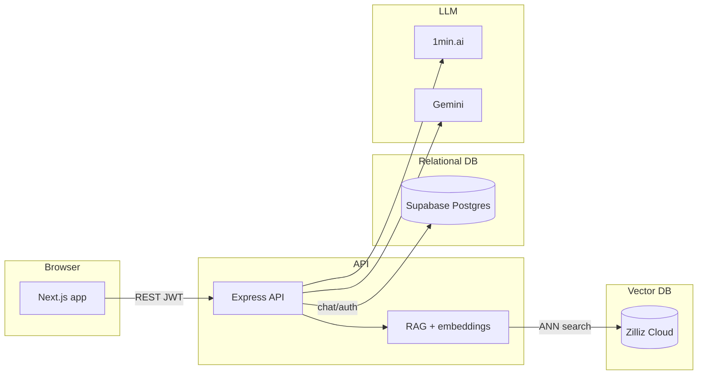

# Medbot

pnpm monorepo: a **Next.js** web app calls an **Express** API. The API runs **RAG** (vector similarity search) on **Zilliz Cloud** (Milvus), then returns answers from a primary chat provider (**1min.ai**) with **Google Gemini** as fallback. Optional **UMLS Metathesaurus** data can be exported to Parquet, embedded with Open Router **nvidia/llama-nemotron-embed-vl-1b-v2**, and upserted into the Zilliz vector collection. **Supabase Postgres** stores chat history, sessions, and user accounts.

## Overview

Typical path: the browser authenticates, sends a question to the API, the API retrieves grounded chunks from the knowledge base, and the model streams the reply back (SSE).



## Stack and versions

Pinned versions below come from workspace `package.json` files; upgrade deliberately and retest RAG if embedding packages change.

| Layer | Technology | Version / notes |
|--------|------------|-----------------|
| Runtime | Node.js | 18+ |
| Package manager | pnpm | 10.x (`packageManager` in root `package.json`) |
| Web | Next.js (App Router), React | Next 16.1.x, React 19.2.x |
| API | Express | ^5.2.x |
| Vector DB | Zilliz Cloud (Milvus) | Collection created via `pnpm zilliz:setup` |
| Relational DB | Supabase Postgres | Chat, auth, ingest state — schema from this repo |
| Embeddings (query) | ONNX Nomic locally **or** OpenRouter (`EMBEDDING_PROVIDER`) | See [`apps/api/src/config/embeddingContract.js`](apps/api/src/config/embeddingContract.js) and `apps/api/.env.example` |
| Chat providers | 1min.ai (primary), Gemini (fallback) | API keys in env |

## Prerequisites

- Node.js 18 or newer  
- pnpm 10 (see root `package.json` → `packageManager`)  
- A Supabase project with Postgres (chat/auth storage)  
- A Zilliz Cloud cluster with an API key (vector search)  
- Python 3.10+ if you run UMLS export or ingest scripts  
- API accounts: 1min.ai and Google Gemini  

Python deps for UMLS scripts (from repository root):

```bash
pip install -r apps/api/scripts/requirements.txt
```

Export uses `pyarrow`; ingest adds `torch`, `transformers`, `requests`, `python-dotenv`, and `pymilvus`. For GPU embedding, install a CUDA-enabled `torch` from [pytorch.org](https://pytorch.org/).

## Install

```bash
git clone <repository-url>
cd medical-chatbot
pnpm install
```

### From GitHub ZIP → new Git repository

Downloading **Code → Download ZIP** from GitHub gives a folder **without** `.git` history (typically `<repo>-<branch>`, e.g. `medical-chatbot-main`). To start your own repo:

1. Unzip and `cd` into the folder (rename it if you like).
2. `git init`
3. `git add .` then `git commit -m "Initial import from upstream"`
4. Create an empty repository on your host (GitHub, etc.), add it as `origin`, and `git push -u origin main`

Then run `pnpm setup:env`, edit `apps/api/.env` and `apps/web/.env.local` with real values (ZIPs never contain secrets), and continue with **Quick start** below.

Optional API/dev handbook (structured JSON for doc UIs): [`docs/api-handbook.json`](docs/api-handbook.json).

## Quick start

One shot from the repository root:

```bash
pnpm quickstart
```

Runs `pnpm install`, then `pnpm bootstrap` (creates env files from examples if missing, applies DB schema, seeds a user **only if** `SEED_USER_EMAIL` and `SEED_USER_PASSWORD` are set in `apps/api/.env`).

Step by step:

```bash
pnpm install
pnpm setup:env
# Edit apps/api/.env (Supabase, Zilliz, JWT, provider keys) and apps/web/.env.local
pnpm bootstrap
cd apps/api && pnpm zilliz:setup && cd ../..
pnpm dev
```

| Script | Purpose |
|--------|---------|
| `pnpm setup:env` | Copies `apps/api/.env.example` → `apps/api/.env` and `apps/web/.env.example` → `apps/web/.env.local` only if targets are missing. |
| `pnpm bootstrap` | Runs `db:schema` then `seed:user:maybe` (skips when `SEED_*` unset). |
| `pnpm db:schema` / `pnpm seed:user` | Schema or seed only (delegates to `apps/api`). |

Typical URLs: web `http://localhost:3000`, API `http://localhost:5000`, health `http://localhost:5000/api/chat/health`.

```bash
pnpm lint
pnpm build
```

## Environment variables

Copy examples, then edit:

```bash
# from repo root
pnpm setup:env
# or manually:
cp apps/api/.env.example apps/api/.env
cp apps/web/.env.example apps/web/.env.local
```

Keep `NEXT_PUBLIC_API_URL` aligned with the API host and port (default API port **5000**, no trailing slash).

### API (`apps/api/.env`)

| Variable | Role |
|----------|------|
| `PORT` | API listen port (default `5000`) |
| `LOG_LEVEL` | `error` \| `warn` \| `info` \| `http` \| `debug` — structured JSON logs ([`apps/api/src/utils/logger.js`](apps/api/src/utils/logger.js)) |
| `DATABASE_URL` | **Required** for `pnpm db:schema` — Postgres connection string (Supabase Dashboard → Database, port **5432**). If `db:schema` fails with `getaddrinfo EAI_AGAIN`, try the **session pooler** URI from the dashboard (IPv4). |
| `SUPABASE_URL` | Supabase project URL |
| `SUPABASE_KEY` | Supabase key for chat/auth tables via PostgREST ([`apps/api/src/config/supabase.js`](apps/api/src/config/supabase.js)) |
| `SUPABASE_SERVICE_ROLE_KEY` | Preferred for auth paths ([`apps/api/src/config/supabaseAuth.js`](apps/api/src/config/supabaseAuth.js)); bypasses RLS for `app_users`. If unset, `SUPABASE_KEY` is used as fallback |
| `JWT_SECRET` | Signs JWTs for login (**required** for protected chat routes) |
| `JWT_EXPIRES_IN` | JWT lifetime (e.g. `1d`) |
| `ZILLIZ_ENDPOINT` | Zilliz Cloud public endpoint (e.g. `https://in01-xxx.api.gcp-us-west1.zillizcloud.com`) |
| `ZILLIZ_TOKEN` | Zilliz Cloud API key |
| `ZILLIZ_COLLECTION` | Collection name (default `knowledge_base`) |
| `EMBEDDING_PROVIDER` | `onnx` (default) or `openrouter` |
| `EMBEDDING_DIM` | Vector size; must match Zilliz collection and model (default `768`) |
| `OPENROUTER_API_KEY` | Required when `EMBEDDING_PROVIDER=openrouter` |
| `OPENROUTER_EMBED_MODEL` | OpenRouter embeddings model id (see `.env.example`) |
| `INGEST_EMBED_PROVIDER` | Optional; Python ingest only — `openrouter` or `hf` / `torch` |
| `SEED_USER_EMAIL` / `SEED_USER_PASSWORD` | Optional; first user for `pnpm seed:user` / `pnpm bootstrap` |
| `ONEMIN_API_KEY` | Primary chat provider |
| `GEMINI_API_KEY` | Fallback chat model |
| `UMLS_META_DIR` | Path to UMLS `META` folder (RRF files) for export |
| `UMLS_SAB_ALLOWLIST` | Optional vocabulary filter for export |
| `EXPORT_MAX_CUIS` | Cap CUIs in Parquet (`0` = full) |
| `INGEST_MAX_ROWS` | Cap rows loaded from Parquet (`0` = all rows in file) |
| `INGEST_BATCH_SIZE` | Ingest batch size |
| `NOMIC_ONNX_MODEL` | Override ONNX model id (default `Xenova/nomic-embed-text-v1`) |
| `NOMIC_HF_MODEL` | Override HF model for Python ingest (default `nomic-ai/nomic-embed-text-v1.5`) |
| `NOMIC_DOCUMENT_PREFIX` / `NOMIC_QUERY_PREFIX` | Must stay aligned with ingest; see embedding contract |

### Web (`apps/web/.env.local`)

| Variable | Role |
|----------|------|
| `NEXT_PUBLIC_API_URL` | API origin, **no** trailing slash (e.g. `http://localhost:5000`) |

Do not commit real secrets; only `.env.example` files belong in git.

## Database schema

**Postgres (Supabase)** stores chat sessions, chat logs, user accounts, and ingest state. Vector embeddings live in Zilliz Cloud.

Apply the relational schema to an empty Supabase Postgres:

```bash
pnpm db:schema
```

Runs [`supabase/schema/full_schema_empty_database.sql`](supabase/schema/full_schema_empty_database.sql). Requires **`DATABASE_URL`** in `apps/api/.env`.

Modular install: see [`supabase/schema/FRESH_INSTALL_ORDER.sql`](supabase/schema/FRESH_INSTALL_ORDER.sql).

Create the Zilliz vector collection (FloatVector dim = `EMBEDDING_DIM`, default 768; COSINE, AUTOINDEX):

```bash
cd apps/api && pnpm zilliz:setup
```

**RLS:** Login and `app_users` expect a **service role** key via `SUPABASE_SERVICE_ROLE_KEY` so server-side operations are not blocked by anon policies.

## Authentication

1. **Bootstrap user (optional):** set `SEED_USER_EMAIL` and `SEED_USER_PASSWORD` in `apps/api/.env`, then `pnpm bootstrap` or `pnpm seed:user`.  
2. **Login:** `POST /api/auth/login` with JSON `{ "email", "password" }` → `{ token, user }`.  
3. **Session:** send `Authorization: Bearer <token>` on protected API routes.  
4. **Profile:** `GET /api/auth/me` with the same header.

All `/api/chat/*` routes except **`GET /api/chat/health`** require a valid JWT.

## Optional knowledge base (UMLS Parquet)

Requires a **licensed** UMLS Metathesaurus extract. Point `UMLS_META_DIR` at the `META` directory containing `MRCONSO.RRF`, `MRDEF.RRF`, and `MRSTY.RRF`.

Export English concepts with definitions to Parquet (convention: under `data/`):

```bash
cd apps/api
pnpm export:umls-meta-parquet
```

Defaults cap CUIs and ingest rows for smaller Zilliz tiers. Set `EXPORT_MAX_CUIS=0` or `INGEST_MAX_ROWS=0` for a full load.

Ingest embeddings and upsert into the Zilliz collection:

```bash
pnpm ingest:umls-meta
```

The ingest script requires `ZILLIZ_ENDPOINT` and `ZILLIZ_TOKEN`. Supabase credentials (`SUPABASE_URL`/`SUPABASE_KEY`) are optional — used only for `ingestion_file_state` idempotency tracking.

**Embedding contract:** provider, model, dimension (`EMBEDDING_DIM`), and query/document prefixes must match between ingest and the running API. Single source of truth: [`apps/api/src/config/embeddingContract.js`](apps/api/src/config/embeddingContract.js). Changing dim or model family requires a **new** Zilliz collection and full re-ingest.

| Item | Typical value | Env override |
|------|----------------|--------------|
| Provider (API) | `onnx` (local Nomic) | `EMBEDDING_PROVIDER` (`openrouter` for hosted embeds) |
| ONNX model (API, onnx) | `Xenova/nomic-embed-text-v1` | `NOMIC_ONNX_MODEL` |
| OpenRouter model | `nvidia/llama-nemotron-embed-vl-1b-v2:free` | `OPENROUTER_EMBED_MODEL` |
| OpenRouter key | — | `OPENROUTER_API_KEY` (never commit; rotate if exposed) |
| HF model (Python ingest) | `nomic-ai/nomic-embed-text-v1.5` | `NOMIC_HF_MODEL` |
| Python ingest backend | follows `EMBEDDING_PROVIDER` or `INGEST_EMBED_PROVIDER` | `INGEST_EMBED_PROVIDER=openrouter` forces HTTP ingest |
| Dimension | 768 (Nomic); set to model output for Nemotron etc. | `EMBEDDING_DIM` |
| Document prefix | `search_document: ` | `NOMIC_DOCUMENT_PREFIX` |
| Query prefix | `search_query: ` | `NOMIC_QUERY_PREFIX` |

Pre-download the ONNX model to avoid a slow first request (skipped when `EMBEDDING_PROVIDER=openrouter`):

```bash
cd apps/api
pnpm nomic:cache
```

## HTTP API contract

Base URL: `http://<host>:<PORT>` (default port `5000`). JSON bodies unless noted.

### Auth (`/api/auth`)

| Method | Path | Auth | Description |
|--------|------|------|-------------|
| `POST` | `/api/auth/login` | No | Body: `{ "email", "password" }` → JWT + user |
| `GET` | `/api/auth/me` | Bearer | Current user |

### Chat (`/api/chat`)

| Method | Path | Auth | Description |
|--------|------|------|-------------|
| `GET` | `/api/chat/health` | No | Health check |
| `POST` | `/api/chat/message` | Bearer | Body: `{ "question", "sessionId"? }` → `{ sessionId, answer }` |
| `POST` | `/api/chat/stream` | Bearer | **SSE** (`text/event-stream`); body same as `/message` |
| `GET` | `/api/chat/sessions` | Bearer | List sessions |
| `GET` | `/api/chat/session/:sessionId/history` | Bearer | Session messages |
| `GET` | `/api/chat/search` | Bearer | Query: `q` (min 2 characters), optional `limit`, `offset` |
| `PATCH` | `/api/chat/session/:sessionId` | Bearer | Metadata: `title`, `isPinned` |
| `DELETE` | `/api/chat/session/:sessionId` | Bearer | Delete session |
| `POST` | `/api/chat/session/:sessionId/cleanup` | Bearer | Cleanup temporary session |

**SSE events** (`/api/chat/stream`): `stream_start` → zero or more `stream_chunk` (`{ chunk }`) → `stream_end` (`{ fullAnswer, sessionId, timestamp }`) or `stream_error` (`{ message }`). Comment lines (`: ping`) may appear for keepalive.

Rate limiting applies to several chat routes (see [`apps/api/src/routes/chat.routes.js`](apps/api/src/routes/chat.routes.js)).

### Integration artifacts

Example HTTP collections: [`apps/api/docs/`](apps/api/docs/).

## Operations

- **Health:** `GET /api/chat/health` for load balancers and smoke tests.  
- **Logging:** API emits structured JSON lines to stdout; tune verbosity with `LOG_LEVEL` (`info` or `warn` in production; avoid `debug`). Sensitive keys are not logged in request metadata ([`apps/api/src/middleware/requestLogger.js`](apps/api/src/middleware/requestLogger.js)).  
- **Database:** Use Supabase backups / point-in-time recovery per your project plan; test restores periodically.  
- **Third-party quotas:** Monitor 1min.ai and Gemini usage, rate limits, and billing in their consoles.  
- **CORS:** API uses `cors()` with default settings ([`apps/api/src/app.js`](apps/api/src/app.js)); tighten for production if the web origin is fixed.

### Deploying the web app (example: Vercel)

Set the Vercel project root to `apps/web`. Set `NEXT_PUBLIC_API_URL` to your deployed API base URL (no trailing slash). Build: `pnpm build` as configured for that app.

The API must be reachable from the browser for the web app; host the API on your platform of choice (VPS, container, PaaS) with the same env vars as production.

## Troubleshooting

- **`Cannot find module 'postgres'`:** run `pnpm install` at the repository root.  
- **Web cannot reach the API:** check `NEXT_PUBLIC_API_URL` and that the API listens on the matching host/port.  
- **Zilliz connection errors:** verify `ZILLIZ_ENDPOINT` and `ZILLIZ_TOKEN`; ensure the collection exists (`pnpm zilliz:setup`).  
- **Slow first embedding:** `cd apps/api && pnpm nomic:cache`.  
- **Login fails or 401 on chat:** set `JWT_SECRET`, run `pnpm seed:user` (or `SEED_*` + `pnpm bootstrap`), ensure `SUPABASE_SERVICE_ROLE_KEY` or `SUPABASE_KEY` is a **service role** key where required.  
- **`pnpm bootstrap` fails at schema:** set **`DATABASE_URL`** in `apps/api/.env` from Supabase → Database (try pooler URI if direct host fails DNS).

## Disclaimer

This software does **not** replace professional medical advice. You are responsible for compliance in your jurisdiction. Google Gemini and 1min.ai have their own terms, quotas, and pricing.
